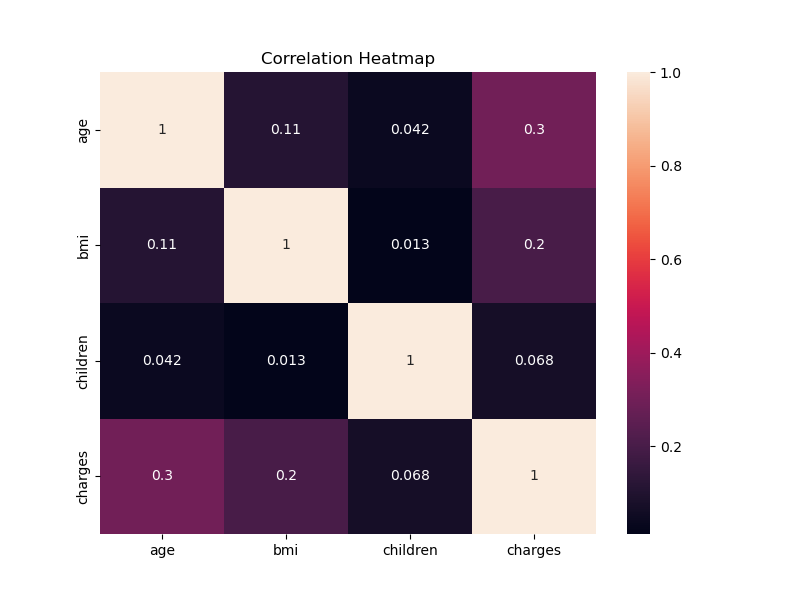
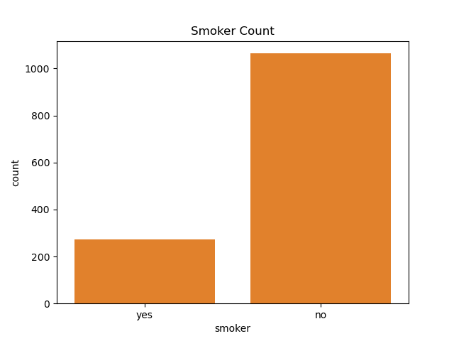
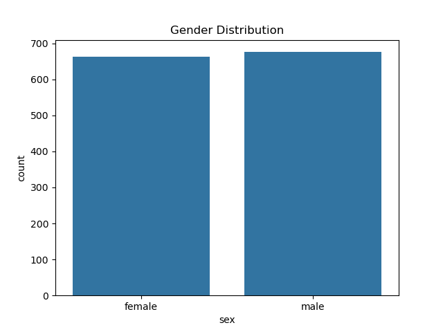
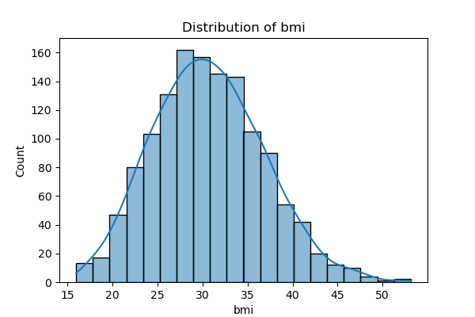

# Insurance EDA Project 📊

This project focuses on Exploratory Data Analysis (EDA) and data preprocessing using a healthcare insurance dataset. The main goal of this project was to analyze patterns, trends, and relationships in the data using Python and visualization libraries.

---

# Project Overview

In this project, I performed:

- Exploratory Data Analysis (EDA)
- Data Cleaning & Preprocessing
- Data Visualization
- Feature Understanding
- Pattern & Trend Analysis

The dataset contains information related to:
- Age
- BMI
- Smoking habits
- Region
- Number of children
- Insurance charges

---

# Technologies Used

- Python
- Pandas
- NumPy
- Matplotlib
- Seaborn
- Jupyter Notebook

---

# Key Insights

Some important insights discovered during analysis:

- Smoking significantly increases insurance charges
- BMI shows correlation with medical expenses
- Data visualization helps identify trends and outliers
- Age and lifestyle factors impact insurance costs

---

# Project Structure

```text
insurance-eda-project/
│
├── data/
│   └── insurance.csv
│
├── notebooks/
│   └── insurance_eda_analysis.ipynb
│
├── images/
│
├── README.md
│
├── requirements.txt
│
└── .gitignore
```

---

# Visualizations

## Correlation Heatmap



---

## Smoker Count Distribution



---

## Gender Distribution



---

## BMI Distribution



---

# Future Improvements

- Feature Engineering
- Machine Learning Model Building
- Dashboard Development
- Advanced Statistical Analysis

---

# Learning Outcome

This project helped strengthen my understanding of:

- Data Analysis
- Exploratory Data Analysis (EDA)
- Data Visualization
- Data Preprocessing
- Working with real-world datasets

---
